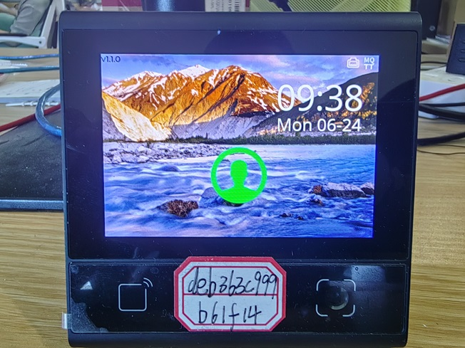
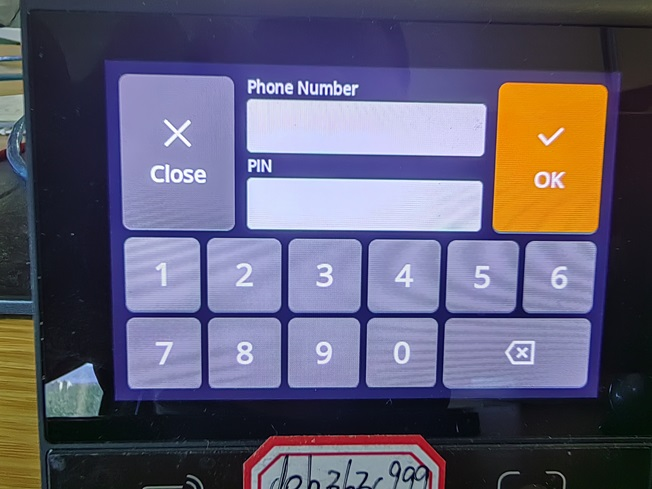
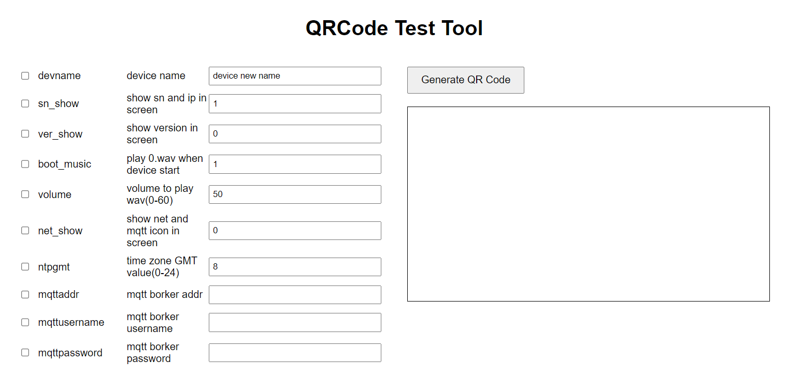

    <a href="./README_CN.md">Chinese</a>| <b>English</b>

<h1 align="center">MQTT-based Online Access Control Example</h1>

## **DEMO Overview**
The device model is DW200, a multifunctional all-in-one machine with a touchscreen.
In this DEMO, the DW200 communicates northward with the application via the MQTT protocol and southward controls the door lock through GPIO.
This DEMO implements access control in three ways, as follows:
- QR Code Scanning: The device scans the QR code and sends its content via MQTT to the application. The MQTT server determines whether to allow access based on the content.
- Mobile Number and Password: Sent via MQTT to the MQTT server. The application determines whether to allow access based on the content.
- ID and Password: Sent via MQTT to the MQTT server. The application determines whether to allow access based on the content.

If the application determines that access should be granted, it sends an MQTT command to remotely control the device's GPIO to unlock the door. Simultaneously, it plays a sound, displays corresponding images on the screen, etc., to notify the user.

## **Basic Functions**
- Read QRCode or Barcode and automatically upload via MQTT after reading.
- QR codes with special prefixes act as configuration codes, allowing the modification of some basic device parameters, such as MQTT Broker address, network information, whether to display specific elements on the screen, etc.
- Remote modification of some basic device parameters via the MQTT protocol.
- Control device behavior via the MQTT protocol, such as remote audio playback, remote unlocking, and remote display of specified images.
- Support upgrading JS code and resource files (audio, images, etc.) in the device via QR code or MQTT protocol. The files to be upgraded are compressed into a zip and deployed at an accessible remote HTTP address.
- Support for touchscreen input on the screen for phone number, ID number, and password, and send to the application via MQTT protocol after confirmation.
- Support watchdog functionality; the application will automatically restart if there is no response within the specified seconds.
- Display Ethernet and MQTT icons on the screen to indicate network connection status and MQTT Broker connection status.
- Display the current time on the screen; the device will correct the time every reboot and automatically calibrate every 24 hours.
- Any operation on the screen triggers a short beep; configuration errors or other operation errors trigger a long beep or double short beeps to notify the user.

## **Directory Description**
- docs: Some screenshots of the device screen.
- source: All source codes and resource files for the demo.
- test: MQTT testing tools and QR code generation tools for testing purposes.

## **Code Description**
1. A total of 4 workers (threads) are started
- main thread: main thread and UI refresh
- mqtt thread: receive MQTT data
- code thread: capture QR code or barcode image and decode
- service thread: subscribe to MQTT and code messages and perform corresponding processing; time-consuming operations are handled asynchronously via setTimeout

2. Main Directory/File Description:
- resource/wav: Multiple audio files
- resource/image: Multiple images, including background images, various icons, etc.
- resource/font.ttf: OpenSans-Regular font library
- main.js: Program entry point, where various device threads and drivers are initialized, and UI is drawn in a loop
- driver.js: Initialization and simple encapsulation of various driver components for DW200
- codehandler.js: QR code processing, configuration code triggers configuration modification, other QR codes pass through MQTT
- config.json: Device configuration initialization JSON file
- constants.js: Some constant settings
- mqtthandler.js: MQTT data processing, receiving and handling MQTT commands
- service.js: Subscribe to MQTT and code messages and call mqtthandler and codehandler for processing

## **Screenshots**

