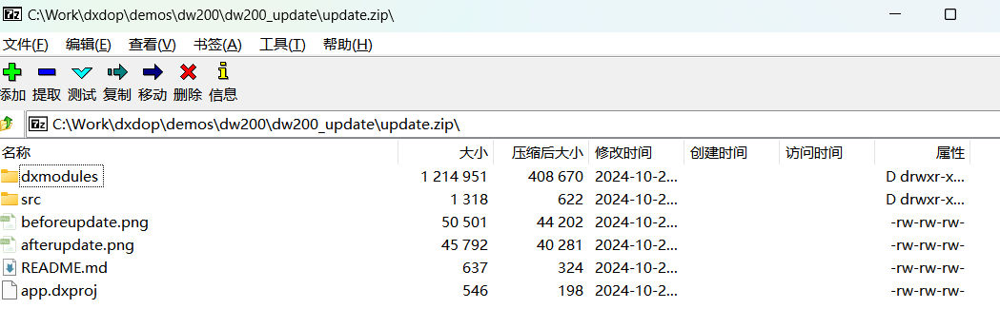
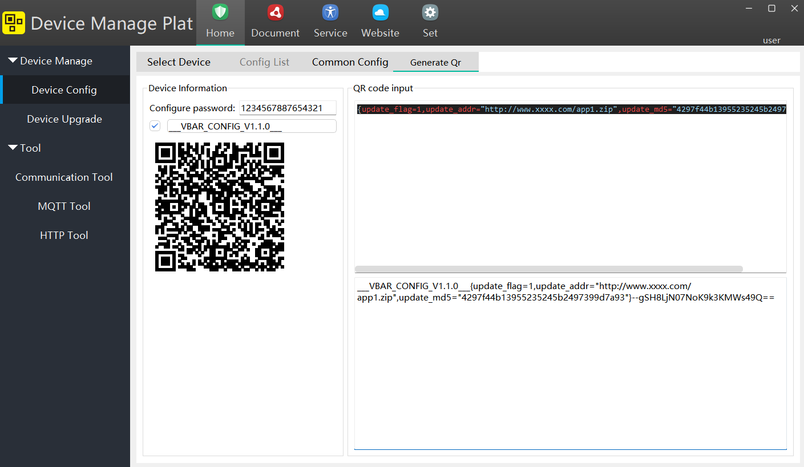
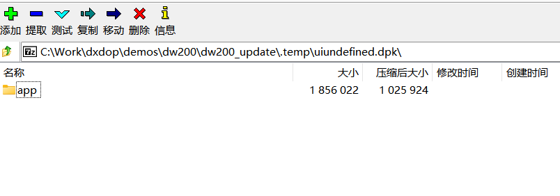
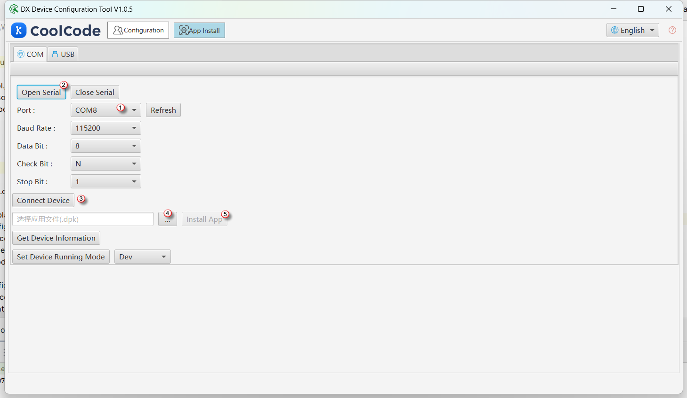

<p align="right">
    <a href="./app.md">English</a>| <b>中文</b>
</p>

# 应用打包、安装和升级
## 概述

dejaOS 的应用在开发完成后需要打包并安装到其他设备上。以 DW200 为例，通常过程如下：

1. 购买少量的 DW200 开发设备，可能只有一台，开发自己的 JavaScript 代码，进行开发和调试，直到完成预期的需求，然后打包应用。
2. 购买多个 DW200 生产设备，将打包好的应用安装到这些设备上。
3. 生产设备安装并部署到生产环境。如果需要升级应用，可以通过扫描二维码或通过网络下发升级指令，设备会通过网络下载最新的应用并覆盖旧的应用。

早期版本和最新版本的打包、安装和升级都有差异，我们分开来看。

## 早期版本
### 1. 应用打包
早期的打包需要手动完成，即将项目的 `dxmodules` 目录、`src` 以及其他自定义目录压缩成一个 zip 文件，参考如下截图：


### 2. 应用安装
早期版本安装自己开发的应用比较繁琐：

1. 首先将应用打包成早期版本的 zip 文件，比如文件名为 app1.zip，并通过工具计算该文件的 md5，假设这个值为 `4297f44b13955235245b2497399d7a93`。
2. 上传这个文件到一个设备可以访问到的网络地址，比如 URL 为 `http://www.xxxx.com/app1.zip`。
3. 按照规则拼接成以下结构的字符串，注意**不是**标准的 JSON 结构：

    ``` json
    {update_flag=1,update_addr="http://www.xxxx.com/app1.zip",update_md5="4297f44b13955235245b2497399d7a93"}
    ```

4. 通过工具将这个字符串生成二维码，我们会提供相应的工具。



5. 生产设备插上网线启动，确保生产设备能访问到那个下载地址，把上一个步骤生成的二维码让生产设备扫码，生产设备会下载 app1.zip 并重启升级到最新版本。
### 3. 应用升级

应用升级是围绕着 dxOTA 组件来实现的，都是通过将新的安装包放在互联网的下载地址，然后通过二维码或其他方式将这个地址推送给设备，设备再通过网络下载。但是详细的过程都封装在 dxOTA 组件里，开发者只需调用一个函数即可。

使用 `dxOTA.update()` 函数，详细的说明和代码可以参考 [GitHub](https://github.com/duoxianwulian/DejaOS/tree/main/demos/dw200/dw200_update)。


## 最新版本

### 1. 应用打包
最新的版本可以通过点击插件的 `package` 按钮自动生成打包文件，文件保存在 .temp 目录下，扩展名为 .dpk，其本质仍是一个压缩文件，但目录结构与早期版本有所不同。



### 2. 应用安装
最新版本相对简单很多：

1. 通过 VSCode 生成 dpk 文件。
2. 通过串口连接设备和电脑，通过电脑上的一个烧录工具将 dpk 烧录到设备里。



 - 选择正确的串口
 - 打开串口
 - 点击连接设备（需要手动重启一下设备）
 - 选择 dpk 文件
 - 点击安装

## 3. 应用升级

应用升级是围绕着 dxOTA 组件来实现的，都是通过将新的安装包放在互联网的下载地址，然后通过二维码或其他方式将这个地址推送给设备，设备再通过网络下载。但是详细的过程都封装在 dxOTA 组件里，开发者只需调用一个函数即可。

使用 `dxOTa.updateHttp()` 函数，详细的说明和代码可以参考 [GitHub](https://github.com/duoxianwulian/DejaOS/tree/main/demos/dw200/dw200_update_new)。
