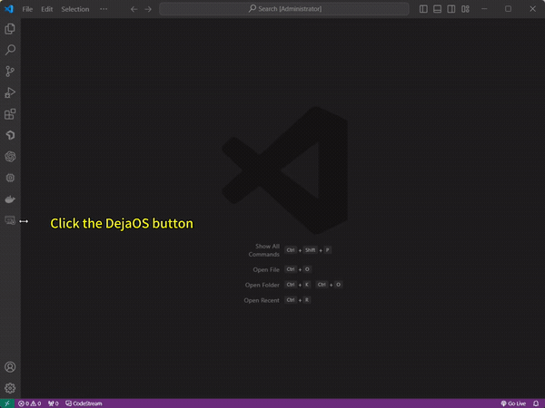
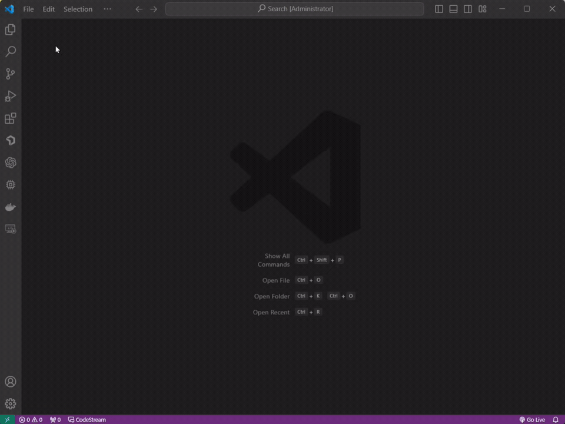
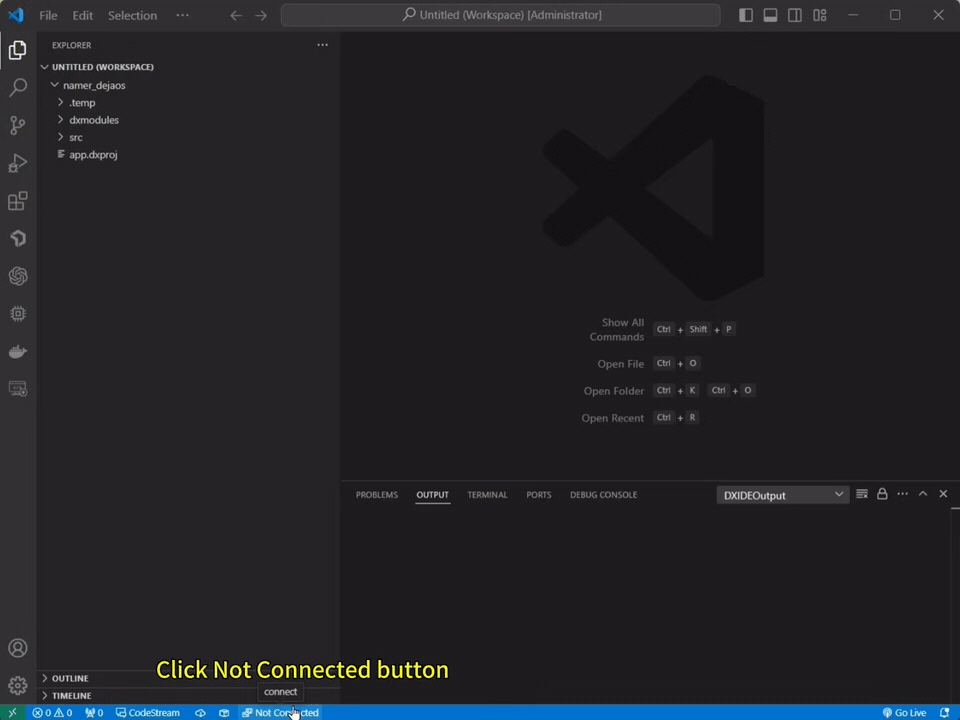
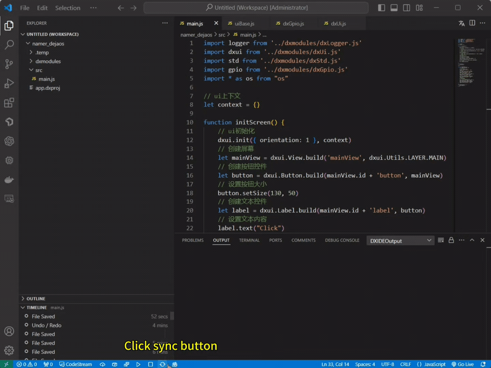
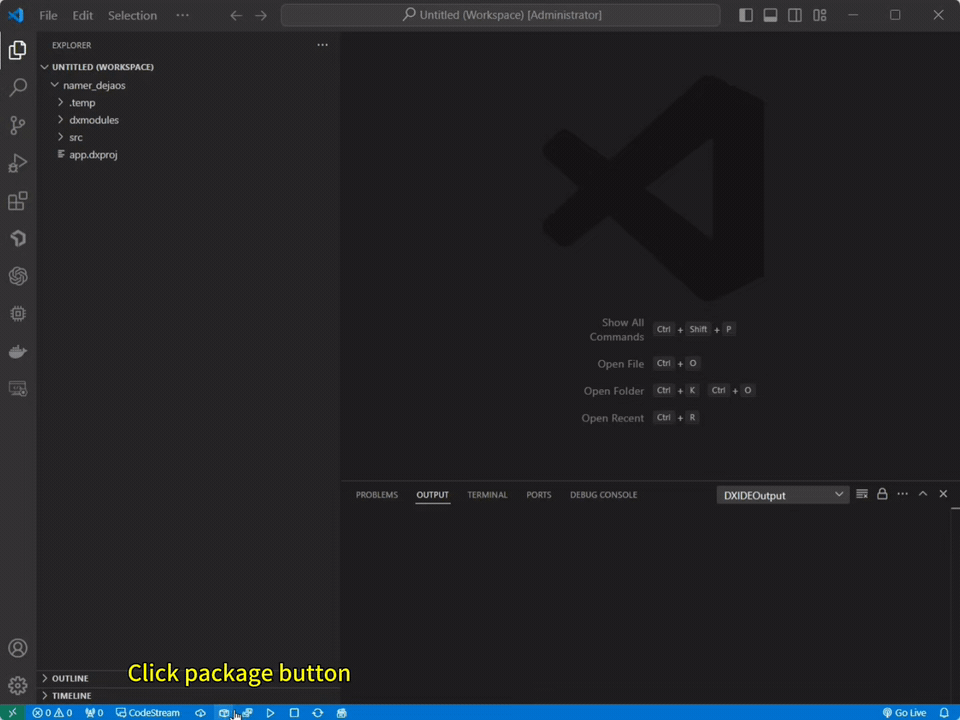

<p align="right">
    <b>English</b>| <a href="./demo_CN.md">中文</a>
</p>

# Create project

**Create a new project**

Start VSCode and click on the `DejaOS` button in the sidebar, select `Create Project`, name the project, select the path to save the project, and click `Submit`.



Click the `app.dxproj` file in the directory to open a visual configuration interface, modify the configuration information, click the `Add Module` button, find the required module to add and save.


**Import old project**

The project file is usually a compressed file with a `.dpk` extension. After extracting it, launch VSCode and open a new window in the `/app/code` directory of the extracted file.



# Connect the device and fully synchronize the code

Click the `Not Connected` button under VSCode to connect the device, click the `syscAll` button after success, select `yes` in the pop-up window and wait patiently.



# Write code

This step adds a button to operate the relay switch.

```javascript
import logger from '../dxmodules/dxLogger.js'
import dxui from '../dxmodules/dxUi.js'
import std from '../dxmodules/dxStd.js'
import gpio from '../dxmodules/dxGpio.js'
import * as os from "os"

// ui context
let context = {}

function initScreen() {
  // ui init
  dxui.init({ orientation: 1 }, context)
  // Create screen
  let mainView = dxui.View.build('mainView', dxui.Utils.LAYER.MAIN)
  // Create a button control
  let button = dxui.Button.build(mainView.id + 'button', mainView)
  // Set button size
  button.setSize(130, 50)
  // Create a label control
  let label = dxui.Label.build(mainView.id + 'label', button)
  // Set text content
  label.text("Click")
  // Set text color
  label.textColor(0x000000)
  // Set the position of the text in the button
  label.align(dxui.Utils.ALIGN.CENTER, 0, 0)
  // Listen for button click event
  button.on(dxui.Utils.EVENT.CLICK, handleGpio)
  // Load screen
  dxui.loadMain(mainView)
}

(function() {
  initScreen()
})();

function handleGpio () {
  const gpio_id_dw200 = 44
  // Init gpio
  let res = gpio.init()
  logger.info('init gpio', res)
  // Request gpio
  res = gpio.request(gpio_id_dw200)
  logger.info('request gpio', res)
  // Output high level to open the relay
  res = gpio.setValue(gpio_id_dw200, 1)
  logger.info('Output high level',res)
  // Get whether the current level is high or low
  res = gpio.getValue(gpio_id_dw200)
  logger.info('The level is now', res)
  // Wait 3 seconds
  os.sleep(3000)
  // Output low level to close the relay
  res = gpio.setValue(gpio_id_dw200, 0)
  logger.info('Output low level', res);
  res = gpio.getValue(gpio_id_dw200)
  logger.info('The level is now', res);
}

std.setInterval(() => {
  dxui.handler()
}, 5)
```

# Run program

After writing the code, click `sync` button to synchronize the changed code to the device, click `start` button after completion, and observe the operation log of the console and the effect on the development device.



# Package project

After completing the expected requirements, clicking the `package` button will package the project as an installation package `.dpk` file and save it in the `.temp` directory of the project.



# Subsequent steps

- If you want to install the packaged application on the production device or upgrade the application, see [App Packaging、Installation、Upgrade](./app.md).
- Please refer to [Example] (./example.md) for some code examples.