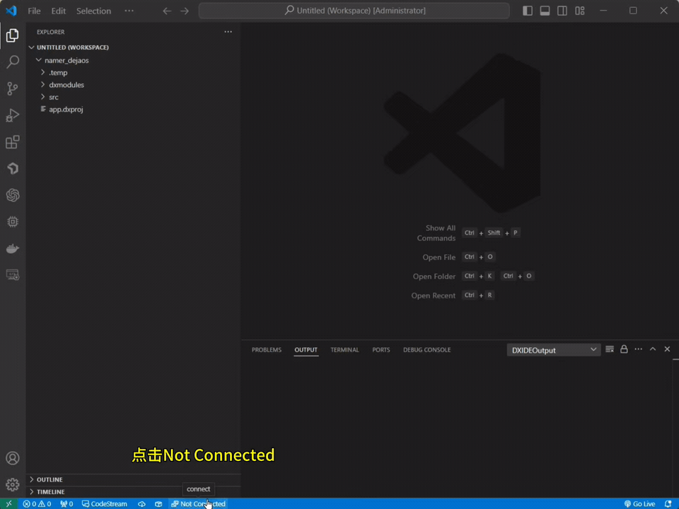
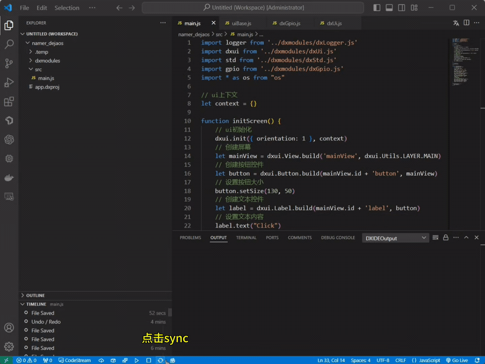
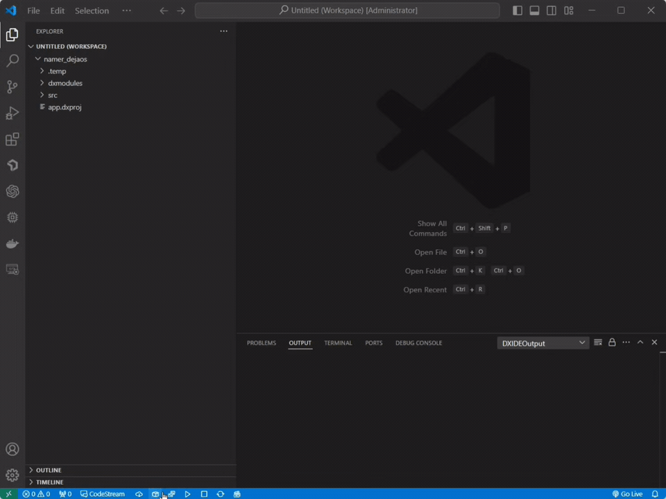

<p align="right">
    <a href="./demo.md">English</a>| <b>中文</b>
</p>

# 创建项目

启动 VSCode 并点击侧边栏的 `DejaOS` 按钮，选择 `Create Project`，为项目命名，选择项目存放路径，点击 `Submit`


点击目录下的 `app.dxproj` 文件，打开一个可视化配置界面，修改配置信息后点击 `Add Module` 按钮，找到所需模块后添加保存


# 连接设备，全量同步代码

点击 VSCode 下面的 `Not Connected` 按钮连接设备，成功后点击 `syscAll` 按钮，弹窗中选择 `yes` 后耐心等待



# 编写代码

此步骤将添加一个按钮用于操作继电器开关，在入口文件 `main.js` 中写入如下代码：

```javascript
import logger from '../dxmodules/dxLogger.js'
import dxui from '../dxmodules/dxUi.js'
import std from '../dxmodules/dxStd.js'
import gpio from '../dxmodules/dxGpio.js'
import * as os from "os"

// ui上下文
let context = {}

function initScreen() {
  // ui初始化
  dxui.init({ orientation: 1 }, context)
  // 创建屏幕
  let mainView = dxui.View.build('mainView', dxui.Utils.LAYER.MAIN)
  // 创建按钮控件
  let button = dxui.Button.build(mainView.id + 'button', mainView)
  // 设置按钮大小
  button.setSize(130, 50)
  // 创建文本控件
  let label = dxui.Label.build(mainView.id + 'label', button)
  // 设置文本内容
  label.text("Click")
  // 设置文本颜色
  label.textColor(0x000000)
  // 设置文本在按钮中的位置
  label.align(dxui.Utils.ALIGN.CENTER, 0, 0)
  // 监听按钮的点击事件
  button.on(dxui.Utils.EVENT.CLICK, handleGpio)
  // 加载屏幕
  dxui.loadMain(mainView)
}

(function() {
  initScreen()
})();

function handleGpio () {
  const gpio_id_dw200 = 44
  //初始化 gpio
  let res = gpio.init()
  logger.info('初始化 gpio', res)
  //申请gpio
  res = gpio.request(gpio_id_dw200)
  logger.info('申请gpio', res)
  //输出高电平 代表打开继电器
  res = gpio.setValue(gpio_id_dw200, 1)
  logger.info('输出高电平',res)
  //获取当前是高电平还是低电平
  res = gpio.getValue(gpio_id_dw200)
  logger.info('现在电平为', res)
  //等待3秒
  os.sleep(3000)
  //输出低电平 代表关闭继电器
  res = gpio.setValue(gpio_id_dw200, 0)
  logger.info('输出低电平', res);
  res = gpio.getValue(gpio_id_dw200)
  logger.info('现在电平为', res);
}

std.setInterval(() => {
  dxui.handler()
}, 5)
```

# 运行项目

编写完代码后点击 `sync` 按钮，同步变化的代码到设备里，完成后点击 `start` 按钮，观察控制台的运行日志及开发设备上的效果



# 项目打包

完成预期的需求后，点击 `package` 按钮，会把项目打包成安装包 `.dpk` 文件保存在项目的 `.temp` 目录下



# 后续步骤

如果您想将打包好的应用安装到生产设备上或者是需要升级应用，请参考[应用打包、安装和升级](./app_CN.md)