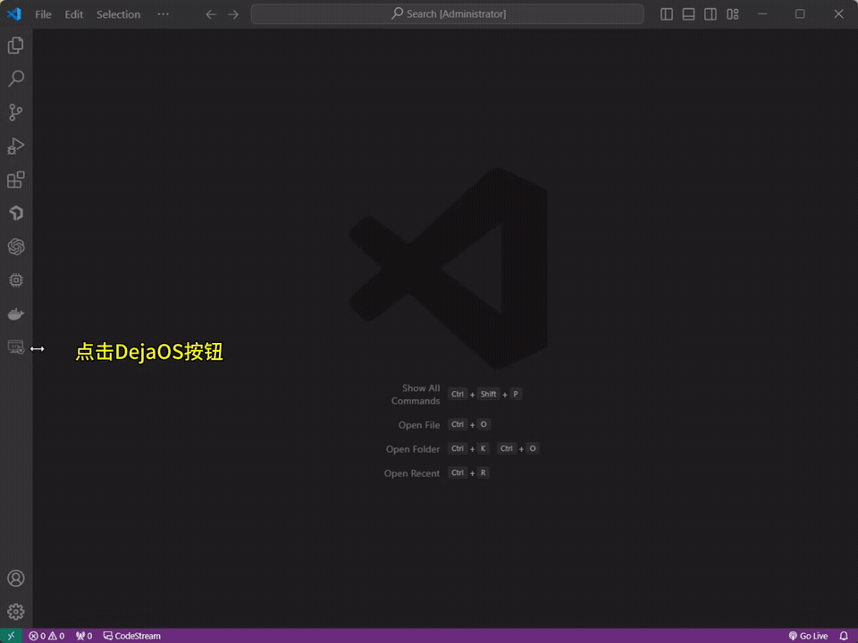

    <a href="./demo.md">English</a>| <b>中文</b>

# 创建项目

启动 Visual Studio Code 并点击侧边栏的 `DejaOS` 按钮，选择 `Create Project`，为项目命名，选择项目存放路径，点击 `Submit`

点击目录下的 `app.dxproj` 文件，打开一个可视化配置界面，修改配置信息后点击 `Add Module` 按钮，找到所需模块后添加保存

# 连接设备，全量同步代码

# 编写代码

# 运行项目