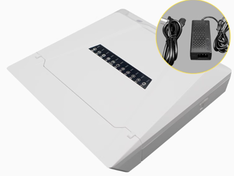
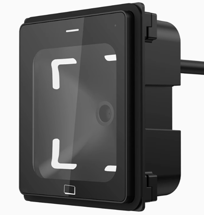
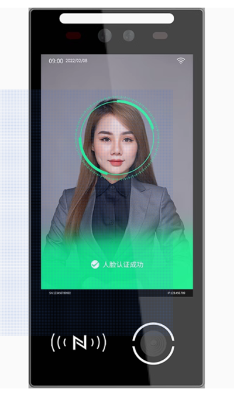

    <a href="./device.md">English</a>| <b>中文</b>

# dejaOS 配套设备介绍
在理解 dejaOS 之前，我们需要区分开发板的概念. 嵌入式开发者通常熟悉开发板，它们是由芯片厂商提供的，包含设计好的电路板和适配的操作系统.开发者在此基础上进行开发，并对接多个模块（如蓝牙、WiFi 等）. 然而，开发者往往需要设计额外的电路板和外壳，并整合在一起，整个过程需要专业的硬件团队和较长的周期. 而应用开发者即便在开发板上实现功能，所得到的也是一堆零散的硬件，难以形成稳定的产品.

与此不同，dejaOS 是基于成熟的工业级硬件设备开发，类似于在手机上进行开发. 这些硬件经过严格设计与测试，如防水、防尘以及适应极端温度，符合各种工业标准.因此，应用开发者可以在这些设备上直接进行开发，最终产品就能够顺利用于生产环境.

dejaOS 需要特定设备才能运行，目前主要兼容酷豆物联的设备. dejaOS 作为 JavaScript 运行时环境，底层采用 C/C++ 实现，可以在不同的 SOC 上编译与运行，但针对不同的芯片、系统和模块，仍需一定的适配工作.

## 开发设备和生产设备
用于开发的设备和用于生产的设备差别不大，差别就是有一些设备型号的开发设备会独立的多出一根 USB 的线，通过这个线才能和 VSCode 通信实现代码的实时传输和调试。
还有一个差别是设备里面的固件应用有一些差异，开发设备里有内置的调试应用。

## 微处理器支持分类
1. MIPS 架构的[君正](https://www.ingenic.com.cn/)芯片
2. ARM 架构的[亿智](https://www.eeasytech.com/)芯片

对于使用这两种芯片的其他厂商设备，适配 dejaOS 相对容易很多.

## 设备用途分类
1. 控制板：通过网络与应用系统交互，南向通过串口控制一个或多个设备，支持 GPIO 输入输出. 通常没有屏幕，以型号 CC101 为例:

2. 读头：通常由控制板控制，具备识别卡片、二维码等功能，也可具备网络功能，北向直接与应用系统交互.通常没有屏幕，以型号 Q350 为例：

3. 人脸设备：内置人脸识别相关软硬件，配备6寸以上屏幕，具备网络功能，内部应用以人脸识别为主. 以型号 VF105 为例：

4. 多功能面板：可应用于多种场景，提供完善的接口，包括网络、NFC、蓝牙、串口、GPIO、二维码等，并配有屏幕. 以型号 DW200 为例：

> 以上相关设备内置的标准应用也都是使用 dejaOS 开发的，我们都会开源，大家可以基于这个做相应的改动会简单很多.
