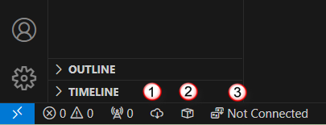
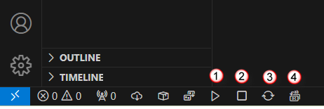
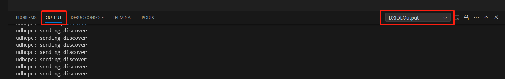
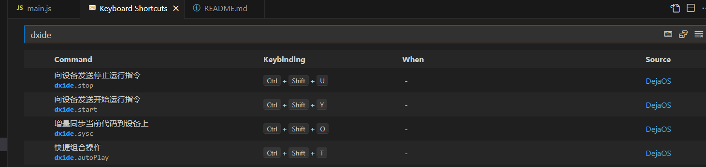
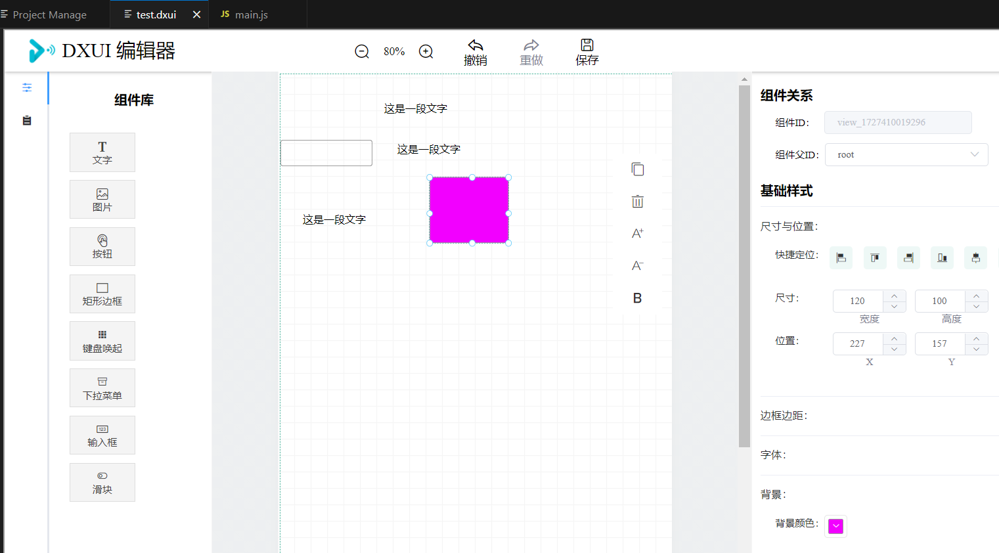

    <a href="./dxide.md">English</a>| <b>中文</b>

# DXIDE 的介绍
DXIDE 是基于 VSCode 的插件，安装后，要触发插件的功能，需要打开一个目录，这个目录下必须要有 `app.dxproj` 文件，这个文件是我们的 dejaOS 应用的特定项目描述文件。

## 未连接设备状态

没有连接设备之前也可以编辑代码，只是无法运行代码，目前还不支持模拟器。这种状态下左下角有3个按钮
1. `install` : 类似 `npm install`,用于下载依赖的 modules, 依赖的module 列表在 `app.dxproj` 文件里定义. 
2. `package`: 开发完用于构建应用包(dpk文件), 因为是脚本代码，无需编译，只是把相应的代码和资源文件做压缩。
3. `connect`: 通过 USB 线连上设备后，设备启动完，点击此按钮可以和设备建立连接，连接成功失败在右下角都有弹出窗口提示，连接成功后就进入连接设备状态。 

## 已连接设备状态：

连上设备后，左下角多了4个按钮
1. `start`: 启动设备里的应用
2. `stop`: 停止设备里的应用
3. `sync`: 同步变化的代码到设备里
4. `syncAll`: 同步所有代码到设备里
通常第一次启动应用前，需要通过 `syncAll` 来把所有代码都同步到设备里，这通常需要长一点的时间，按钮旁边有同步的进度. 后续对代码的小的改动，可以通过 `sync` 按钮只会把有变化的文件同步到设备里面.

## 查看日志：
在 VSCode 主界面的下的 `OUTPUT` 标签栏里查看

## 快捷方式

其中ctrl+shirt+T 可以实现 同步代码+停止应用+运行应用，非常方便

## 可视化编辑 GUI
在 VSCode 下还支持通过可视化拖拽的方式生成 GUI ，入下图

只需要给文件命名的扩展名为`.dxui`,点击这个文件即可打开编辑页面

> 目前可视化编辑功能还不完善，所以建议还是用 js 代码来构建，后续我们会逐渐完善这个功能
