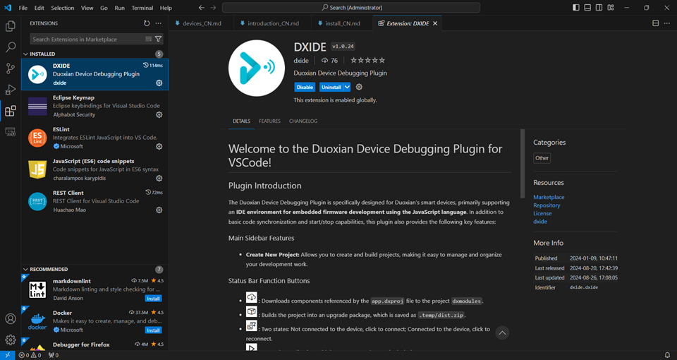

    <a href="./install.md">English</a>| <b>中文</b>

# 如何安装 dejaOS
dejaOS 做为 JavaScript 运行时环境，并不需要额外安装，我们提供的设备自带.

dejaOS 开发环境需要安装：
1. VSCode : [官方地址](https://code.visualstudio.com/download)
2. Nodejs :  [官方地址](https://nodejs.org/),版本需要是 20+
3. DXIDE: VSCode的插件，直接在VSCode Extensions Marketplace里下载安装 [DXIDE](https://marketplace.visualstudio.com/items?itemName=dxide.dxide)

> 目前开发环境还不支持 MAC 和 Linux，主要是设备在这2个环境下无法通过 USB 识别，后续我们会完善此功能

# 网络环境
官方提供的 module 很多，可以选择其中一部分下载到本地，需要能访问互联网