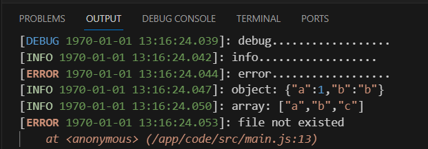

<p align="right">
    <a href="./lvgl.md">English</a>| <b>中文</b>
</p>

# dxLogger 及调试介绍
dejaOS 的应用开发过程中，目前还不支持单步跟踪调试，只能依靠打印日志来调试运行中的数据, js 最基础的 `console.log` 在dejaOS 下是**不建议**使用的，因为它无法做到实时打印，我们使用 `dxLogger` 来替代，使用方式也很简单，参考以下示例:
``` js
import log from '../dxmodules/dxLogger.js'

log.debug("debug..................")
log.info("info..................")
log.error("error..................")

let obj ={a:1,b:"b"}
log.info('object:',obj)

let arr = ['a','b','c']
log.info('array:',arr)

let err = new Error("file not existed")
log.error(err)
```

支持3种级别的打印，不同的级别在 `OUTPUT` 区域显示的文字颜色有差异

如果打印的是一个 Error 对象，会自动打印出详细的错误栈，方便定位到错误在代码的哪一行

