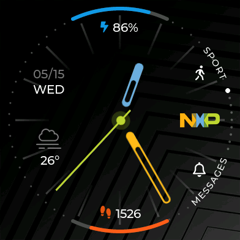

    <b>English</b>| <a href="./lvgl_CN.md">中文</a>

# Introduction to the GUI Engine of dejaOS  
dejaOS is designed for devices with screens, which necessitates the use of a GUI engine. We utilize the [LVGL](https://lvgl.io/) engine. LVGL (Lightweight and Versatile Graphics Library) is a free and open-source graphics library that provides everything needed to create embedded GUIs, featuring user-friendly graphical elements, attractive visual effects, and low memory consumption.  

  

Currently, LVGL is very popular in the field of embedded devices, widely used in smart home systems, industrial control, consumer electronics, and more. LVGL integrates numerous characteristics, such as small footprint, multi-platform compatibility, easy portability, user-friendliness, and open-source availability, making it particularly suitable for operation on resource-constrained embedded devices.  

While LVGL is developed in C, dejaOS combines LVGL with QuickJS, allowing developers to use JavaScript functions to invoke LVGL for GUI construction.  

## Key Features of LVGL:  
- **Lightweight**: LVGL is designed for efficiency, enabling smooth operation on devices with limited memory and processing power, making it ideal for low-power embedded applications.  

- **Rich Components**: It offers a variety of graphical elements and controls, such as buttons, sliders, charts, and lists, facilitating the rapid construction of complex user interfaces.  

- **Themes and Styles**: Custom themes and styles are supported, allowing applications to have an appealing look and feel, thereby enhancing the user experience.  

- **Multi-Platform Support**: LVGL can run on various hardware platforms and operating systems, supporting multiple display interfaces like LCD and OLED, which simplifies the development and porting process.  

- **Strong Community Support**: As an open-source project, LVGL has an active community where developers can access extensive documentation and examples and contribute to the library's improvement.  

## Application Scenarios:  
LVGL is suitable for a range of embedded systems, including but not limited to home appliances, medical devices, automotive dashboards, and wearable technology, providing a smooth user interaction experience. Its flexibility and scalability allow developers to easily customize the UI to meet specific application requirements.  

In summary, the choice of LVGL as the GUI engine for dejaOS enables high-quality graphical interfaces for users while ensuring excellent performance and experience in resource-limited environments.  
