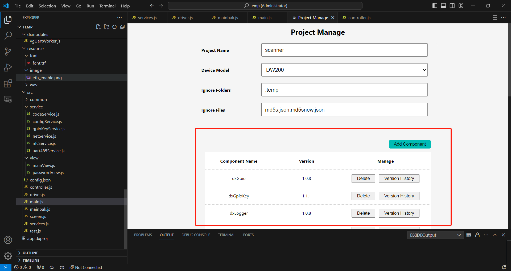
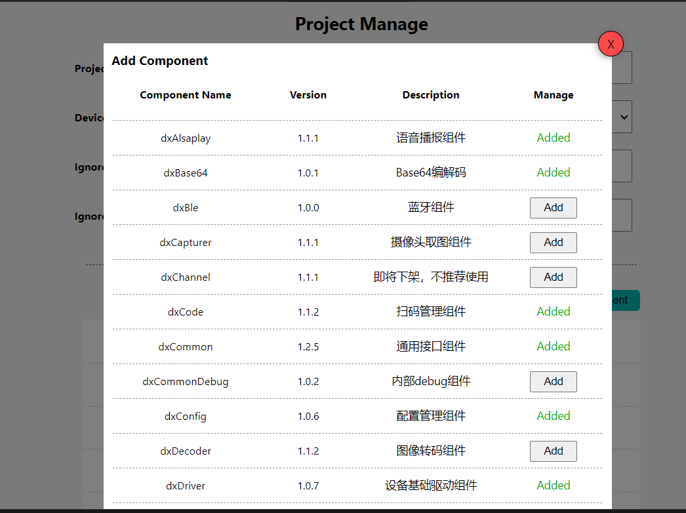
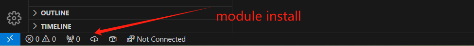

    <a href="./module.md">English</a>| <b>中文</b>

# dejaOS 的 module 介绍
dejaOS 的模块导入使用 `import` 语句来引入其他模块的功能(ES6 module import), 模块导出使用 `export` ,这种方式对熟悉 JavaScript 的开发者来说非常直观。详细的说明可以参考[相关文档](https://developer.mozilla.org/zh-CN/docs/Web/JavaScript/Reference/Statements/import)

> dejaOS 的所有 module 都是以 `dx` 开头

## 模块管理：
在模块管理方面，dejaOS 并没有使用 JavaScript 最常用的 `npm` ，主要原因是嵌入式设备内的应用通常不需要依赖太多第三方库。由于涉及到与系统相关的模块（如 C/C++），这些模块需要基于特定设备重新编译，因此我们绝大部分应用都是使用 dejaOS 内置的模块，并依赖自己的模块管理系统。

如果需要使用第三方模块，dejaOS 仅支持纯 JavaScript 的模块且只支持 ES6 module import。开发者可以手动拷贝并下载这些模块到自己的项目中。未来，我们也计划将常见的第三方模块整合进 dejaOS 的模块管理系统，以便于用户使用。

我们提供了可视化的界面来选择模块，VSCode 的 DXIDE 插件支持基于 Web 页面选择不同的模块或其版本，极大地方便了开发者的工作。

> 在 dejaOS , 模块也常称为组件(Component)

## 模块安装
类似于 `npm install`，dejaOS 通过可视化的按钮来实现模块安装，这也是通过 VSCode 的 DXIDE 插件提供的 `install` 按钮完成的。用户只需点击该按钮，即可轻松安装所需的模块，简化了开发过程。

> 这里需要访问互联网，从我们提供的 Web 服务上下载文件，如果无法实时访问互联网，也可以联系我们，我们可以单独提供

## 总结
dejaOS 的模块管理系统旨在为嵌入式设备提供高效、简便的开发体验。通过自定义的模块管理和可视化界面，开发者能够快速找到并安装所需模块，推动嵌入式应用的开发进程。我们将不断扩展模块库，提升系统的灵活性和可用性。