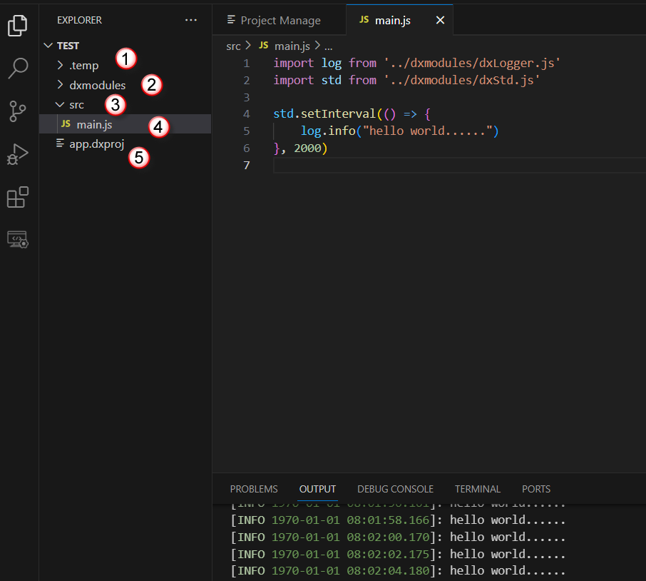
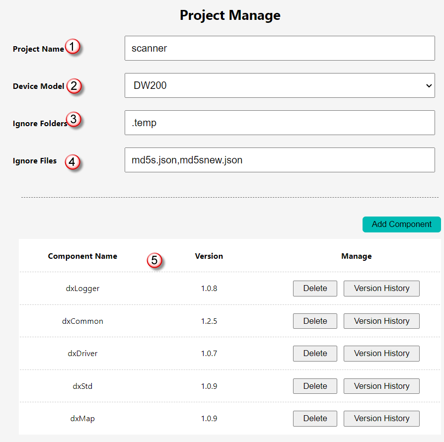

    <a href="./project.md">English</a>| <b>中文</b>

# dejaOS 项目结构介绍
dejaOS 开发的应用项目结构比较简单，有一定的固定结构，有一些目录和文件是必须要有的，如下图:

1. `.temp` 目录：这个目录是自带生成的，即使删除也会重新生成，我们可以不用关心这个目录，里面是一些临时文件，也不会同步到设备上
2. `dxmodules` 目录：这个目录是通过 `install` 按钮把依赖的 module 相关文件都下载到这个目录下，这个目录下包含了多个 .js 文件和 .so文件，因为我们所有 module 都是以 `dx` 开头，所以目录名称也是 `dxmodules`. 这个目录我们也不需要手动去维护，在我们写的代码 `CTRL+点击` 所依赖的 module 的函数时，可以跳转到相关的这个目录下的 js 文件，可以查看详细的注释。
3. `src` 目录：这个目录是**必须要有**的,所有的源码都可以放在里面，当然你也可以把一些资源文件或其它非 js 文件放在和 `src` 同级的目录，同步时也会同步到设备里。
4. `main.js` : 这个文件是整个程序的入口文件，**必须要有**，也必须在 `src` 目录下
5. `app.dxproj`: 这个文件是项目配置文件，也是**必须要有**，本质是一个 JSON 文件，为了方便修改，点击这个文件会自动打开 web 页面来可视化操作，如下图：

- 5.1 项目的名称: 这个随意填写
- 5.2 设备的类型: 下拉选择，这个**必须选择正确**的设备类型 ,因为不同的设备类型对应的依赖可能有差异，JavaScript 的 API 可能没有差别，但是依赖的 so 文件可能有差异，另外有一些依赖是特定设备特有的，比如 `dxFace` 是人脸设备特有的。
- 5.3 忽略的目录: 这里的忽略是指这个目录不会同步到设备里，缺省只有`.temp`,如果需要增加自己的目录，可以用逗号隔开增加
- 5.4 忽略的文件: 这里的忽略是指这些文件不会同步到设备里，如果需要增加自己的文件，可以用逗号隔开增加
- 5.5 这里是需要依赖的库(组件): 可以通过 `Add Componennt` 按钮来选择组件及组件的不同版本来增加或删除已选过的组件.

## 最基础的几个组件
参考上图中，这几个组件基本上每个项目都必须依赖，是最基础的组件，这里简单介绍一下：
1. dxLogger: 日志相关的组件，只有是开发，打印日志是少不了的
2. dxCommon: 这是和系统操作相关的组件，也是 dxLogger 依赖的，不可缺少
3. dxDriver: 这是和设备相关的驱动库，它没有提供相关的 API ，但是是不可缺少的
4. dxStd: 这是和系统IO相关的标准库，也是不可缺少的
5. dxMap: 共享内存库，也是被依赖的基础组件